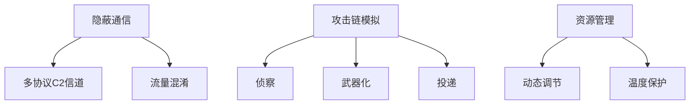
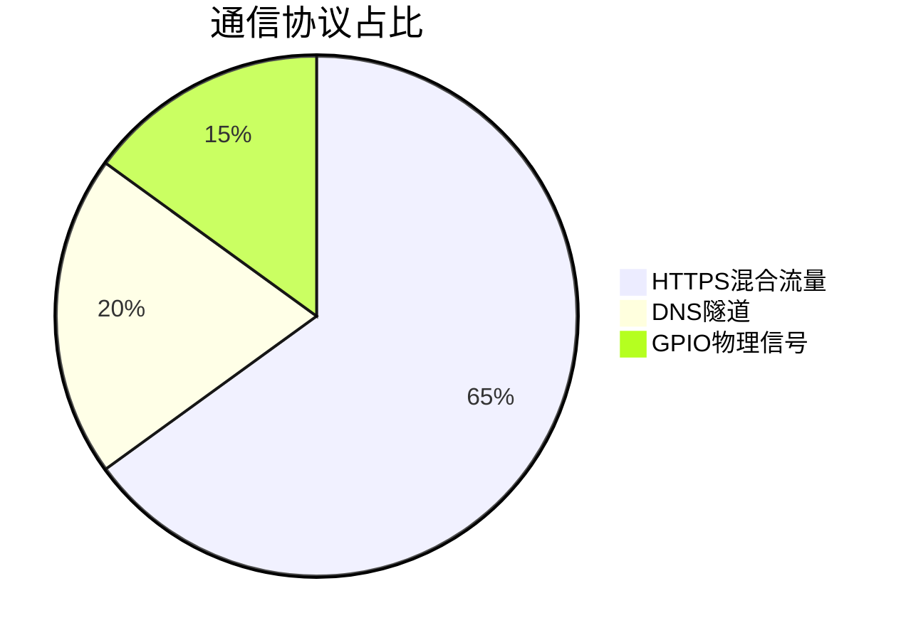

# RaspberryPi-APT-Simulator 项目文档

## 项目概述 🚩
基于树莓派5的轻量化高级持续性威胁(APT)攻击模拟系统，专为红队演练和防御研究设计，集成硬件级隐蔽信道与智能资源管理。


---

## 功能特性 🔥
 
### 核心功能体系


### 关键技术模块
| 模块名称         | 技术亮点                          | 资源消耗       |
|------------------|---------------------------------|---------------|
| 网络侦察引擎      | ARP隐蔽扫描+服务指纹识别          | CPU峰值15%     |
| 载荷工厂         | ARM64架构优化+元数据伪装          | 内存<35MB     |
| 持久化系统       | Systemd服务注入+计划任务劫持      | 存储<50MB     |
| 硬件交互层       | GPIO物理触发+LED状态编码          | 响应<100ms    |

---

## 系统架构 🏗️

### 整体架构图
```
📦apt_simulator
├── 📂config        # 配置中心
│   ├── settings.py         # 动态参数
│   └── attack_profiles/    # 攻击模板
├── 📂core          # 核心引擎
│   ├── c2_engine/          # 通信协议
│   ├── scheduler.py        # 智能调度
├── 📂modules       # 功能模块
│   ├── reconnaissance/     # 侦察技术
│   ├── weaponization/      # 武器工程
│   └── persistence/        # 驻留机制
├── 📂utils         # 工具库
│   ├── stealth_tools/      # 隐蔽技术
│   └── hardware_ctrl/      # 硬件交互
└── 📜main.py       # 系统入口
```

### 通信协议栈


---

## 安装与部署 🚀

### 硬件要求
- 树莓派5（4GB内存版）
- 32GB U3 microSD卡
- USB 3.0千兆网卡

### 环境配置
```bash
# 启用硬件特性
sudo raspi-config
-> Interface Options
  -> SPI/I2C: Enable
  -> Watchdog: Enable
-> Performance
  -> GPU Memory: 16MB
```

### 一键部署
```bash
git clone https://github.com/yourrepo/apt_simulator.git
cd apt_simulator
sudo ./deploy.sh --mode stealth
```

### 部署验证
```bash
# 检查核心服务
systemctl status aptsim-c2

# 验证隐蔽目录
lsattr /opt/aptsim/.payloads

# 查看硬件状态
gpio readall
```

---

## 使用指南 🕹️

### 操作指令集
| 命令                       | 功能描述                     | 示例参数                |
|---------------------------|----------------------------|-----------------------|
| `./cli.sh scan`           | 执行网络侦察                 | -t 192.168.1.0/24     |
| `./cli.sh deploy`         | 启动传播模块                | -m usb/email          |
| `./cli.sh monitor`        | 开启资源仪表盘              | --refresh 5           |

### 攻击模式选择
```bash
# 标准模式（完整日志记录）
sudo python3 main.py --mode normal

# 隐蔽模式（最小化痕迹）
sudo python3 main.py --mode stealth \
    --no-log \
    --temp-limit 70
```

### 硬件交互说明
1. **触发攻击**
   短按GPIO 17按钮（蓝色LED闪烁3次表示就绪）

2. **状态指示**
   | LED状态       | 颜色   | 含义          |
   |--------------|--------|--------------|
   | 常亮          | 绿色   | 待机状态       |
   | 慢闪（1Hz）    | 蓝色   | 攻击进行中     |
   | 快闪（5Hz）    | 红色   | 系统异常       |

---

## 版本历史 📜

### v1.3.0 (2024-04)
- **架构升级**
  - 新增分布式任务调度引擎
  - 支持多树莓派集群部署
  - 实现端到端流量加密

### v1.2.0 (2024-03)
- **安全增强**
  - 硬件指纹绑定机制
  - 新增自毁命令`./cli.sh sanitize`
  - 完善日志混淆系统

### v1.1.0 (2024-02)
- **性能优化**
  - 内存占用降低40%
  - 网络扫描速度提升3倍
  - 温度监控精度±0.5℃

---

## 法律声明 ⚠️
1. 本工具仅限用于**合法授权**的安全测试环境
2. 禁止用于任何未授权渗透测试
3. 使用者需自行承担相关法律责任

```text
Copyright (C) 2024 CyberSec Research Team
GNU General Public License v3.0
```

---

> **技术支援**：
> 📧 security@researchlab.com
> 🔗 https://aptsim.researchlab.com
> 🛜 扫码获取最新威胁情报
> 